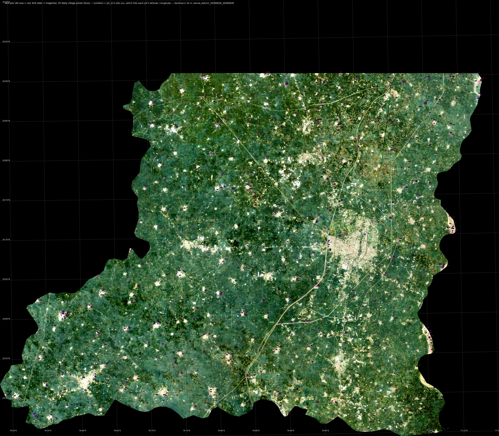
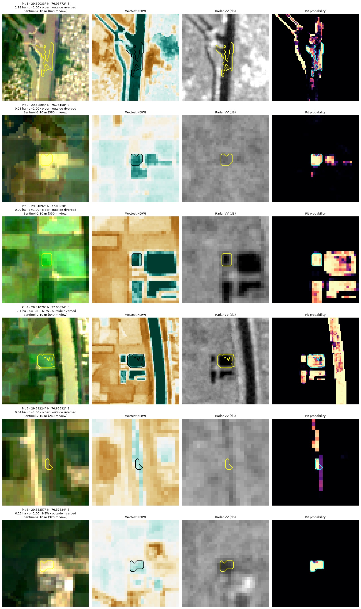
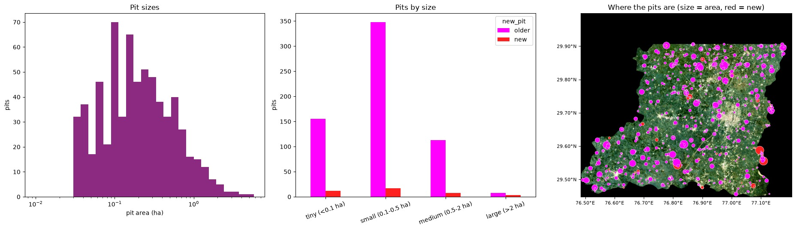
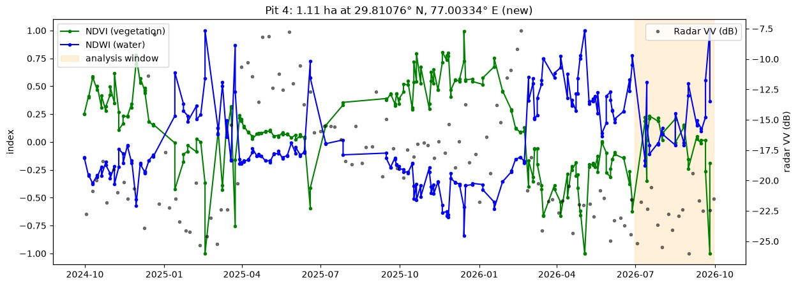
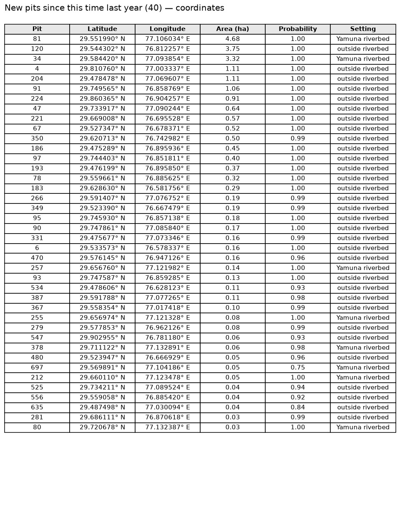
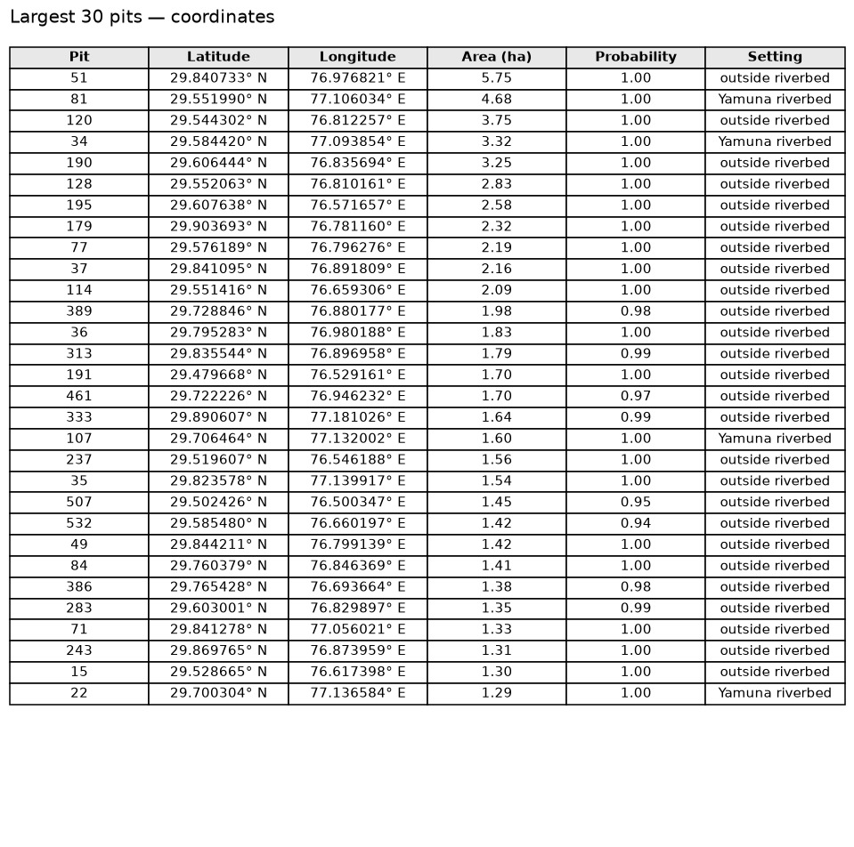

# Karnal pit detection — sand, mining and brick-kiln pits from free satellite data

Finds excavation pits — including small ones — in Karnal district, Haryana (India) using only free data:
Sentinel-2, Sentinel-1, Dynamic World, building maps and AlphaEarth AI embeddings, processed in
Google Earth Engine and at full 10 m detail in Python.

## Results — Karnal district, 30 June to 30 September 2026

| | Pits | Area |
|---|---:|---:|
| Outside the Yamuna riverbed | 616 | 211 ha |
| In the Yamuna riverbed | 48 | 21 ha |
| **Total** | **664** | **232 ha** |
| New since the same months of 2025 | 40 | |
| Likely village ponds (listed separately, not counted above) | 55 | 19 ha |

By size: 167 tiny (< 0.1 ha), 365 small (0.1–0.5 ha), 121 medium (0.5–2 ha), 11 large (> 2 ha).
2,588 km² analysed with 88 Sentinel-2 and 24 Sentinel-1 scenes.

**Treat these as candidates to verify, not confirmed pits.** There is no ground truth yet, so the pit
threshold is the default 0.6. A visual review of the gallery found real excavations (for example a
1.1 ha water-filled pit dug around February 2026, and a new pit beside what looks like a brick kiln) but also remaining
false detections: pieces of canals wider than ~60 m, specks on roads, fish-pond clusters and flood
pools in the riverbed. Labelling a few dozen examples (below) is the way to fix these.

| Gallery (10 m view · water · radar · probability) | Statistics |
|---|---|
|  |   |

Result files in [`results/karnal_2026-06-30_to_2026-09-30/`](results/karnal_2026-06-30_to_2026-09-30/):

| File | What it is |
|---|---|
| `pits.csv` | Every pit: **latitude, longitude**, area, probability, new or older, riverbed or not, pit or likely village pond, Google Maps link |
| `pits.geojson`, `pits.gpkg` | Pit outlines for QGIS / ArcGIS, with latitude / longitude attributes |
| `pits.kml` | Google Earth: outline + numbered pin per pit, coordinates and a Google Maps link in each pin (red = new, magenta = older, blue = likely village pond) |
| `pit_probability.tif` | Pit probability for every 10 m pixel (0–100) |
| `jpg/` | Numbered pit map with a latitude / longitude grid, coordinate tables of the new and largest pits (08, 09), inputs, training examples, validation, probability, 4 gallery pages (coordinates in every title), pit history, statistics |
| `karnal_pit_detection_executed.ipynb` | The notebook with all outputs from this run |

Coordinates are WGS84 decimal degrees (6 decimals ≈ 0.1 m) of each pit's centre — or of a point
inside the pit when its shape is curved — so every pin falls on its pit. The numbers on the map are
the `pit_id` column of `pits.csv`.

## Pit coordinates

Every pit's latitude and longitude are in [`pits.csv`](results/karnal_2026-06-30_to_2026-09-30/pits.csv) (also in the GeoJSON,
GeoPackage and KML). The tables below list the new pits and the largest pits; **Map** opens the spot in
Google Maps.

| New pits — coordinates | Largest pits — coordinates |
|---|---|
|  |  |

<b>40 new pits</b> (cropland in the same months of 2025, bare or flooded now) — largest first

| Pit | Latitude | Longitude | Area (ha) | Probability | Setting | Map |
|---:|---:|---:|---:|---:|---|---|
| 81 | 29.551990 | 77.106034 | 4.68 | 1.00 | Yamuna riverbed | [open](https://www.google.com/maps?q=29.551990,77.106034) |
| 120 | 29.544302 | 76.812257 | 3.75 | 1.00 | outside riverbed | [open](https://www.google.com/maps?q=29.544302,76.812257) |
| 34 | 29.584420 | 77.093854 | 3.32 | 1.00 | Yamuna riverbed | [open](https://www.google.com/maps?q=29.584420,77.093854) |
| 4 | 29.810760 | 77.003337 | 1.11 | 1.00 | outside riverbed | [open](https://www.google.com/maps?q=29.810760,77.003337) |
| 204 | 29.478478 | 77.069607 | 1.11 | 1.00 | outside riverbed | [open](https://www.google.com/maps?q=29.478478,77.069607) |
| 91 | 29.749565 | 76.858769 | 1.06 | 1.00 | outside riverbed | [open](https://www.google.com/maps?q=29.749565,76.858769) |
| 224 | 29.860365 | 76.904257 | 0.91 | 1.00 | outside riverbed | [open](https://www.google.com/maps?q=29.860365,76.904257) |
| 47 | 29.733917 | 77.090244 | 0.64 | 1.00 | outside riverbed | [open](https://www.google.com/maps?q=29.733917,77.090244) |
| 221 | 29.669008 | 76.695528 | 0.57 | 1.00 | outside riverbed | [open](https://www.google.com/maps?q=29.669008,76.695528) |
| 67 | 29.527347 | 76.678371 | 0.52 | 1.00 | outside riverbed | [open](https://www.google.com/maps?q=29.527347,76.678371) |
| 350 | 29.620713 | 76.742982 | 0.50 | 0.99 | outside riverbed | [open](https://www.google.com/maps?q=29.620713,76.742982) |
| 186 | 29.475289 | 76.895936 | 0.45 | 1.00 | outside riverbed | [open](https://www.google.com/maps?q=29.475289,76.895936) |
| 97 | 29.744403 | 76.851811 | 0.40 | 1.00 | outside riverbed | [open](https://www.google.com/maps?q=29.744403,76.851811) |
| 193 | 29.476199 | 76.895850 | 0.37 | 1.00 | outside riverbed | [open](https://www.google.com/maps?q=29.476199,76.895850) |
| 78 | 29.559661 | 76.885625 | 0.32 | 1.00 | outside riverbed | [open](https://www.google.com/maps?q=29.559661,76.885625) |
| 183 | 29.628630 | 76.581756 | 0.29 | 1.00 | outside riverbed | [open](https://www.google.com/maps?q=29.628630,76.581756) |
| 266 | 29.591407 | 77.076752 | 0.19 | 0.99 | outside riverbed | [open](https://www.google.com/maps?q=29.591407,77.076752) |
| 349 | 29.523390 | 76.667479 | 0.19 | 0.99 | outside riverbed | [open](https://www.google.com/maps?q=29.523390,76.667479) |
| 95 | 29.745930 | 76.857138 | 0.18 | 1.00 | outside riverbed | [open](https://www.google.com/maps?q=29.745930,76.857138) |
| 90 | 29.747861 | 77.085840 | 0.17 | 1.00 | outside riverbed | [open](https://www.google.com/maps?q=29.747861,77.085840) |
| 331 | 29.475677 | 77.073346 | 0.16 | 0.99 | outside riverbed | [open](https://www.google.com/maps?q=29.475677,77.073346) |
| 6 | 29.533573 | 76.578337 | 0.16 | 1.00 | outside riverbed | [open](https://www.google.com/maps?q=29.533573,76.578337) |
| 470 | 29.576145 | 76.947126 | 0.16 | 0.96 | outside riverbed | [open](https://www.google.com/maps?q=29.576145,76.947126) |
| 257 | 29.656760 | 77.121982 | 0.14 | 1.00 | Yamuna riverbed | [open](https://www.google.com/maps?q=29.656760,77.121982) |
| 93 | 29.747587 | 76.859285 | 0.13 | 1.00 | outside riverbed | [open](https://www.google.com/maps?q=29.747587,76.859285) |
| 534 | 29.478606 | 76.628123 | 0.11 | 0.93 | outside riverbed | [open](https://www.google.com/maps?q=29.478606,76.628123) |
| 387 | 29.591788 | 77.077265 | 0.11 | 0.98 | outside riverbed | [open](https://www.google.com/maps?q=29.591788,77.077265) |
| 367 | 29.558354 | 77.017418 | 0.10 | 0.99 | outside riverbed | [open](https://www.google.com/maps?q=29.558354,77.017418) |
| 255 | 29.656974 | 77.121328 | 0.08 | 1.00 | Yamuna riverbed | [open](https://www.google.com/maps?q=29.656974,77.121328) |
| 279 | 29.577853 | 76.962126 | 0.08 | 0.99 | outside riverbed | [open](https://www.google.com/maps?q=29.577853,76.962126) |
| 547 | 29.902955 | 76.781180 | 0.06 | 0.93 | outside riverbed | [open](https://www.google.com/maps?q=29.902955,76.781180) |
| 378 | 29.711122 | 77.132891 | 0.06 | 0.98 | Yamuna riverbed | [open](https://www.google.com/maps?q=29.711122,77.132891) |
| 480 | 29.523947 | 76.666929 | 0.05 | 0.96 | outside riverbed | [open](https://www.google.com/maps?q=29.523947,76.666929) |
| 697 | 29.569891 | 77.104186 | 0.05 | 0.75 | Yamuna riverbed | [open](https://www.google.com/maps?q=29.569891,77.104186) |
| 212 | 29.660110 | 77.123478 | 0.05 | 1.00 | Yamuna riverbed | [open](https://www.google.com/maps?q=29.660110,77.123478) |
| 525 | 29.734211 | 77.089524 | 0.04 | 0.94 | outside riverbed | [open](https://www.google.com/maps?q=29.734211,77.089524) |
| 556 | 29.559058 | 76.885420 | 0.04 | 0.92 | outside riverbed | [open](https://www.google.com/maps?q=29.559058,76.885420) |
| 635 | 29.487498 | 77.030094 | 0.04 | 0.84 | outside riverbed | [open](https://www.google.com/maps?q=29.487498,77.030094) |
| 281 | 29.686111 | 76.870618 | 0.03 | 0.99 | outside riverbed | [open](https://www.google.com/maps?q=29.686111,76.870618) |
| 80 | 29.720678 | 77.132387 | 0.03 | 1.00 | Yamuna riverbed | [open](https://www.google.com/maps?q=29.720678,77.132387) |

<b>15 largest pits</b>

| Pit | Latitude | Longitude | Area (ha) | Probability | Setting | Map |
|---:|---:|---:|---:|---:|---|---|
| 51 | 29.840733 | 76.976821 | 5.75 | 1.00 | outside riverbed | [open](https://www.google.com/maps?q=29.840733,76.976821) |
| 81 | 29.551990 | 77.106034 | 4.68 | 1.00 | Yamuna riverbed | [open](https://www.google.com/maps?q=29.551990,77.106034) |
| 120 | 29.544302 | 76.812257 | 3.75 | 1.00 | outside riverbed | [open](https://www.google.com/maps?q=29.544302,76.812257) |
| 34 | 29.584420 | 77.093854 | 3.32 | 1.00 | Yamuna riverbed | [open](https://www.google.com/maps?q=29.584420,77.093854) |
| 190 | 29.606444 | 76.835694 | 3.25 | 1.00 | outside riverbed | [open](https://www.google.com/maps?q=29.606444,76.835694) |
| 128 | 29.552063 | 76.810161 | 2.83 | 1.00 | outside riverbed | [open](https://www.google.com/maps?q=29.552063,76.810161) |
| 195 | 29.607638 | 76.571657 | 2.58 | 1.00 | outside riverbed | [open](https://www.google.com/maps?q=29.607638,76.571657) |
| 179 | 29.903693 | 76.781160 | 2.32 | 1.00 | outside riverbed | [open](https://www.google.com/maps?q=29.903693,76.781160) |
| 77 | 29.576189 | 76.796276 | 2.19 | 1.00 | outside riverbed | [open](https://www.google.com/maps?q=29.576189,76.796276) |
| 37 | 29.841095 | 76.891809 | 2.16 | 1.00 | outside riverbed | [open](https://www.google.com/maps?q=29.841095,76.891809) |
| 114 | 29.551416 | 76.659306 | 2.09 | 1.00 | outside riverbed | [open](https://www.google.com/maps?q=29.551416,76.659306) |
| 389 | 29.728846 | 76.880177 | 1.98 | 0.98 | outside riverbed | [open](https://www.google.com/maps?q=29.728846,76.880177) |
| 36 | 29.795283 | 76.980188 | 1.83 | 1.00 | outside riverbed | [open](https://www.google.com/maps?q=29.795283,76.980188) |
| 313 | 29.835544 | 76.896958 | 1.79 | 0.99 | outside riverbed | [open](https://www.google.com/maps?q=29.835544,76.896958) |
| 191 | 29.479668 | 76.529161 | 1.70 | 1.00 | outside riverbed | [open](https://www.google.com/maps?q=29.479668,76.529161) |

## Repository

| Path | What it is |
|---|---|
| [`notebooks/karnal_pit_detection.ipynb`](notebooks/karnal_pit_detection.ipynb) | Main workflow: Earth Engine features → download → features, training, pit outlines, gallery, maps, pit history, statistics, exports |
| [`gee/mine_pit_detection.js`](gee/mine_pit_detection.js) | The same idea entirely in the Earth Engine Code Editor (no download), with click-to-label layers — see [Use it in Google Earth Engine only](#use-it-in-google-earth-engine-only-no-python) |
| [`tools/pit_verify.py`](tools/pit_verify.py) | Optional stage 2 for high-resolution imagery: confirm / outline candidates with a YOLOv8 detector |
| [`tools/export_jpgs.py`](tools/export_jpgs.py) | Saves every figure of an executed notebook as JPG, plus a numbered full-resolution pit map with a latitude / longitude grid and coordinate tables |

## How it works

1. **Earth Engine** builds features for the analysis window and the same months a year earlier:
   cloud-free Sentinel-2 statistics (10 m vegetation / water / bare-soil indices), Sentinel-1 radar,
   Dynamic World land-cover shares, four building sources that "vote" (Open Buildings, WorldCover,
   Dynamic World, radar double bounce), the Yamuna riverbed zone, and AlphaEarth similarity to typical
   pits / buildings / water / crops.
2. The features are **downloaded** as one GeoTIFF (resumable, with timeouts).
3. **Locally at 10 m**: context features (each pixel vs. its 130 m surroundings), sub-pixel
   water / bare / vegetation / building fractions, automatic training examples plus your own points,
   a gradient-boosting model validated on 5 km blocks it never trained on.
4. **Pit objects**: hysteresis outlines; building pixels removed; tiny pits kept only when very
   confident; canals, drains, roads and thin lines dropped; village ponds tagged; riverbed pits tagged.
5. Optional **2.5 m super-resolution** (SEN2SR) for close-ups and refined outlines.

## Run it

1. Open `notebooks/karnal_pit_detection.ipynb` in Jupyter or Google Colab.
2. In **Settings**, set `PROJECT_ID` to the Google Cloud project you use with Earth Engine.
   Keep `AREA = 'test'` for a quick first run (14 × 13 km along the Yamuna, a few minutes),
   then use `AREA = 'district'` (≈ 2.5 GB download, roughly 10–30 minutes).
3. Run all cells.

**Improve the results:** in section 3, zoom the Satellite basemap to 16–18 and save 30–50 points on
real pits and 30–50 on false detections (canals, fish ponds, roads, roofs). Re-run from section 6 —
no new download. The validation table then shows real accuracy against your points and the
threshold is tuned on them.

Optional super-resolution: `pip install sen2sr mlstac torch`, then re-run from section 10.

## Use it in Google Earth Engine only (no Python)

[`gee/mine_pit_detection.js`](gee/mine_pit_detection.js) does the detection entirely in the
[Earth Engine Code Editor](https://code.earthengine.google.com) — nothing to install or download.
You only need an Earth Engine account with a Cloud project (free for non-commercial use:
[register here](https://code.earthengine.google.com/register)).

**1. Open the script**

1. Go to [code.earthengine.google.com](https://code.earthengine.google.com) and pick your Cloud project
   (top-right, next to your profile picture).
2. **Scripts** panel (left) → **NEW** → **File**, name it e.g. `karnal_pits`.
3. Paste the whole of `gee/mine_pit_detection.js` into the editor and press **Save**.

**2. Choose the area and dates** in the `CONFIG` block at the top of the script:

| Setting | Default | Change it to… |
|---|---|---|
| `state`, `districts` | `'Haryana'`, `[['Karnal']]` | another district, e.g. `[['Sonipat', 'Sonepat']]` (alternative spellings), or several: `[['Karnal'], ['Panipat']]` |
| `endDate` | `null` (today) | a fixed date such as `'2026-09-30'`, so later runs use the same period |
| `monthsBack` | `3` | the length of the window; it is always compared with the same months a year earlier |
| `probabilityThreshold` | `0.6` | lower (e.g. `0.4`) to catch more pits with more false alarms, higher for fewer |
| `minPitAreaHa` | `0.05` | the smallest pit kept (0.05 ha = 5 Sentinel-2 pixels) |

To use your own area instead of a district, draw a polygon with the geometry tools and name the
import `aoi`.

**3. Run** — press **Run** and wait 1–3 minutes until the panel (bottom-left) says *Model ready*.

- **Map** (Layers menu, top-right of the map): *Pit pixels* (magenta), *New pits since this time last
  year* (red), *Removed: looks like a building* (grey) and *District boundaries* are on; *Pit probability*,
  *Model unsure*, Sentinel-2, radar, Dynamic World, building and riverbed layers can be switched on.
  Zoom to level 13+ to see small pits.
- **Console** (right): the period, Sentinel scene counts, training samples, a validation table per
  threshold, and the features the model relies on most.
- **Panel**: **Outline + count pits in current view** (zoom 13+) draws the outlines and counts pits —
  total, new, under 0.5 ha, hectares. Tick **Click map to find pits similar to the clicked one** and
  click any pit to highlight everything that looks like it (AlphaEarth similarity).

**4. Download every pit with its latitude and longitude** — open the **Tasks** tab (top-right) and
press **RUN** on:

| Task | Saved to Google Drive folder `GEE_pits` |
|---|---|
| `karnal_pits_list_<dates>` | CSV: district, **latitude, longitude**, area_ha, prob, new_pit, water_frac, built_frac, compact, `maps_link` (Google Maps) |
| `karnal_pits_polygons_<dates>` | Shapefile of the pit outlines with the same attributes (change `fileFormat` to `'KML'` for Google Earth) |
| `karnal_pit_probability_<dates>` | GeoTIFF of the pit probability (0–100) for every 10 m pixel |

**5. Improve it by labelling** — after the first run the drawing tools (top-left of the map) contain
two point layers, `pits` (red) and `nonPits` (blue). Zoom the Satellite basemap to 16–18, start where
the *Model unsure* layer is, select a layer and click to add points — real pits as `pits`, false
detections (roofs, canals, fish ponds, roads, brick kilns, sand bars) as `nonPits`. 30–50 of each is a
good start. Press **Run** again: the Console now shows a table *Against YOUR points (real accuracy)* —
set `probabilityThreshold` to the row with the best balance. The points are saved with the script, so
keep adding where it is still wrong. With ~100+ of each, `useAutoLabels: false` learns from your
points only.

**If you get "Computation timed out"**: halve `trainingCells` and `riverCells`, or run the
`cache_training_samples_v3_<dates>` task in the Tasks tab, put its asset ID in `samplesAsset`, set
`endDate` to the printed end date and run again — training then takes seconds.

**GEE-only vs the notebook:** the Code Editor script uses the same data, building knowledge,
automatic labels, context features and block validation, with a Random Forest. The notebook adds
gradient boosting at full 10 m, sub-pixel fractions, removal of canal / drain / road fragments and thin
lines, village-pond and riverbed tags, the gallery, pit histories and JPGs — so its counts are cleaner.
The results in this repository come from the notebook.

## Limitations

- Sentinel-2 pixels are 10 m: about 3 pixels (≈ 0.03 ha, e.g. 15 × 20 m) is the smallest pit
  detected reliably.
- Without your labels the model learns from rules, so accuracy is unknown.
- Riverbed detections can be sand mining but also natural sand bars, flood pools or bank erosion.
- AlphaEarth embeddings are annual (2025 for this run); recent change comes from Sentinel-2,
  Sentinel-1 and Dynamic World.
- Super-resolved images are an AI estimate, useful for viewing — not real high-resolution imagery.

## Data and credits

Copernicus Sentinel-1 and Sentinel-2; Cloud Score+; Google Dynamic World; Google DeepMind AlphaEarth
Foundations satellite embeddings; Google Open Buildings 2.5D Temporal; ESA WorldCover; WWF HydroSHEDS
Free-Flowing Rivers; FAO GAUL 2015 boundaries — all via Google Earth Engine. Optional SEN2SR
super-resolution by ESA OpenSR. The detection ideas (context, shape, block validation, local labels)
were informed by [BapakmuLah/Satellit-Based-Open-Pit-Mining-Detection](https://github.com/BapakmuLah/Satellit-Based-Open-Pit-Mining-Detection).
